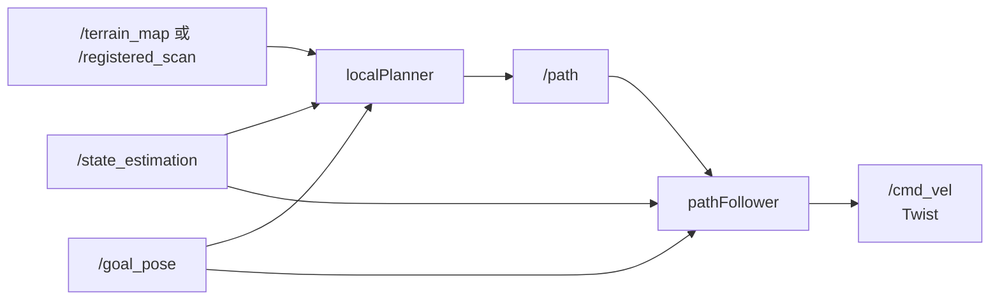

# 机器狗管线探测局部导航

本仓库基于 CMU ground-based autonomous exploration 工程改造，用于全向机器狗的
管线探测、局部避障和 Goal Pose 导航。当前局部规划器已移除四轮车预生成弧形轨迹库，
改为在线生成全方向平移候选，并独立控制机体平移和目标 yaw。

## 导航链路



核心特性：

- 支持 `vx`、`vy`、`yaw_rate` 独立控制和全向移动；
- 使用膨胀后的机器人足迹进行平移及旋转扫掠碰撞检测；
- 综合目标进展、地形代价、方向连续性和执行时间选择局部路径；
- 严格保证 `/cmd_vel` 为零或处于机器狗 SDK 允许的速度区间；
- 只有碰撞检查确认路径末端为目标时，才启用最终 Pose servo。

## 快速开始

ROS 2 Humble 环境下构建：

```bash
./scripts/build.sh
source install/setup.bash
```

真机环境可跳过 Gazebo 相关包：

```bash
./scripts/build_real_robot.sh
./scripts/launch_real_robot_local_nav.sh \
  use_rviz:=true maxSpeed:=0.8 autonomySpeed:=0.6
```

单独启动局部导航并限制速度：

```bash
ros2 launch local_planner local_planner.launch \
  maxSpeed:=0.8 autonomySpeed:=0.6 \
  goalPosThre:=0.15 goalYawThre:=5.0
```

发布 Goal Pose：

```bash
ros2 topic pub --once /goal_pose geometry_msgs/msg/PoseStamped \
  "{header: {frame_id: map}, pose: {position: {x: 2.0, y: 1.0}, orientation: {w: 1.0}}}"
```

## 文档

- [导航架构与算法](docs/holonomic_navigation.md)
- [参数配置说明](docs/parameters.md)
- [Topic、坐标系与运行调试](docs/interfaces_and_operations.md)

主要配置入口是
[`src/local_planner/launch/local_planner.launch`](src/local_planner/launch/local_planner.launch)。

## 保留的 ROS 2 子包

| 子包 | 用途 |
|---|---|
| `local_planner` | 全向局部规划与 Goal Pose 跟随 |
| `terrain_analysis` / `terrain_analysis_ext` | 地形高度、障碍和连通性分析 |
| `sensor_scan_generation` | 生成局部规划使用的扫描数据 |
| `vehicle_simulator` | Gazebo 环境、机器人模型和系统 launch |
| `velodyne_description` / `velodyne_gazebo_plugins` | 仿真激光雷达模型和 Gazebo 插件 |
| `loam_interface` | 真机定位与点云接口适配 |
| `waypoint_rviz_plugin` | 在 RViz 中发布 `/goal_pose` |

上游的探索指标可视化、Garage waypoint 示例和无实际内容的 Velodyne 聚合包已删除；
它们不参与机器狗局部导航闭环。

## 上游项目

仿真环境和基础探索模块来源于 [CMU Exploration](https://www.cmu-exploration.com)。
